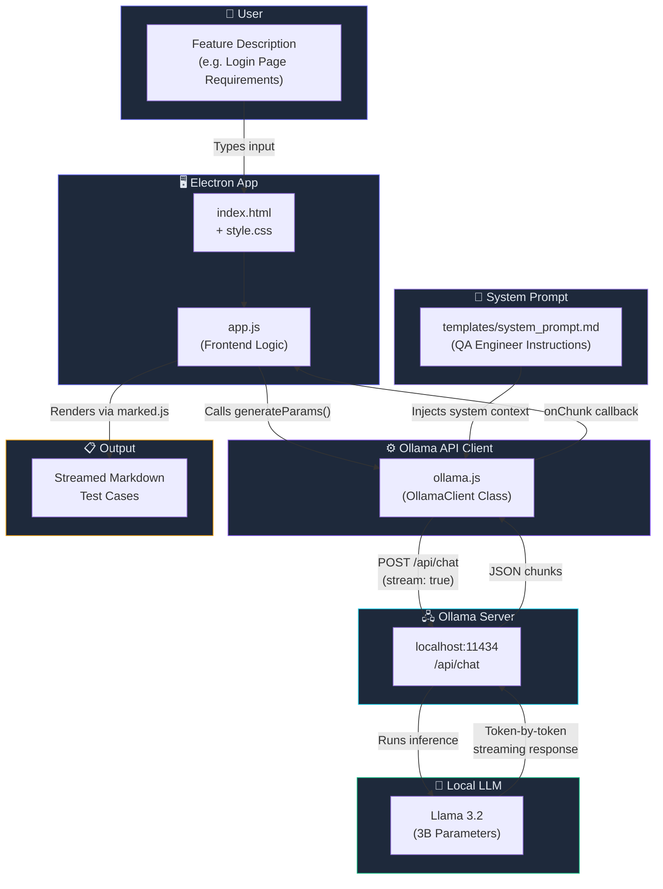

# 🧪 Local LLM Test Case Generator

> A privacy-first, offline desktop application that generates comprehensive QA test cases using a **local LLM (Llama 3.2)** powered by [Ollama](https://ollama.com). No data leaves your machine.

---

## ✨ Features

- 🔒 **100% Local & Private** — All AI inference runs on your machine via Ollama. No cloud APIs.
- ⚡ **Real-time Streaming** — Test cases stream to the UI token-by-token as the LLM generates them.
- 📝 **Structured Output** — Generates Positive, Negative, and Edge Case scenarios in Markdown table format.
- 🖥️ **Electron Desktop App** — Cross-platform GUI with a modern dark-themed interface.
- 🎨 **Markdown Rendering** — Output is parsed and rendered as rich HTML using `marked.js`.

---

## 🏗️ Architecture Flow



### Flow Summary

1. **User** enters a feature description (e.g., _"Login page with email/password auth"_).
2. **app.js** captures the input and calls the `OllamaClient`.
3. **OllamaClient** constructs a chat payload with the **system prompt template** + user input.
4. A `POST` request is sent to the **Ollama server** running locally on `localhost:11434`.
5. **Llama 3.2** processes the prompt and streams tokens back.
6. Each chunk is parsed and **rendered live** in the UI as formatted Markdown test cases.

---

## 📁 Project Structure

```
project1-localtestcasegenerator/
├── index.html                  # Main HTML entry point
├── main.js                     # Electron main process
├── package.json                # Project dependencies
│
├── css/
│   └── style.css               # Dark-themed UI styles
│
├── js/
│   ├── app.js                  # Frontend logic & event handlers
│   └── ollama.js               # Ollama API client (streaming)
│
├── templates/
│   └── system_prompt.md        # QA system prompt template
│
├── architecture/
│   └── SOP_generate_testcases.md   # Standard operating procedure
│
└── tools/
    └── handshake.js            # Connection test utility
```

---

## 🚀 Getting Started

### Prerequisites

| Tool | Version | Purpose |
|------|---------|---------|
| [Node.js](https://nodejs.org/) | v18+ | JavaScript runtime |
| [Ollama](https://ollama.com) | Latest | Local LLM server |
| Llama 3.2 model | — | AI model for generation |

### Installation

1. **Clone the repository**
   ```bash
   git clone https://github.com/Arvindvashishtha/Myprojects.git
   cd Myprojects/project1-localtestcasegenerator
   ```

2. **Install dependencies**
   ```bash
   npm install
   ```

3. **Install & start Ollama** (if not already running)
   ```bash
   ollama serve
   ```

4. **Pull the Llama 3.2 model**
   ```bash
   ollama pull llama3.2
   ```

5. **Launch the app**
   ```bash
   npm start
   ```

---

## 🎯 Usage

1. Launch the application → the status badge should show **"● System Online (Llama 3.2)"**.
2. Enter a feature description in the text area, for example:
   > _"A login page where users can sign in with email/password. It should handle invalid emails, wrong passwords, and lock the account after 3 failed attempts."_
3. Click **"Generate Test Cases"**.
4. Watch as the LLM streams structured test cases in real-time:
   - ✅ Positive Scenarios
   - ❌ Negative Scenarios
   - 🔲 Edge Cases

---

## 🛠️ Tech Stack

| Layer | Technology |
|-------|-----------|
| **Desktop Shell** | Electron |
| **Frontend** | HTML5, CSS3 (Inter font), Vanilla JS |
| **Markdown Rendering** | marked.js (via CDN) |
| **AI Backend** | Ollama (local server) |
| **LLM Model** | Llama 3.2 (3B) |

---

## 🔧 Troubleshooting

| Issue | Solution |
|-------|---------|
| Status shows "Offline" | Ensure Ollama is running: `ollama serve` |
| Model not found | Pull the model: `ollama pull llama3.2` |
| Connection refused | Check if port `11434` is available |
| Blank output | Open DevTools (`Ctrl+Shift+I`) and check console |

---

## 📄 License

ISC

---

<p align="center">
  Built with ❤️ using Electron + Ollama + Llama 3.2
</p>
